# Power System Dynamics \& Stability

  (Note: please fill in your genuine name and institutional email in the following request forms. Fake name or personal email address will *NOT* be responded.)

## IEEE Tranmission Power System Tesbeds

### IEEE 118-bus, 19 generators (PSAT/MATLAB format)
(unit: *rad*; ref. machine: the generator at bus-69; disturbance: fault happens at bus-47 from 1sec to 1.2sec) 

[comment]: 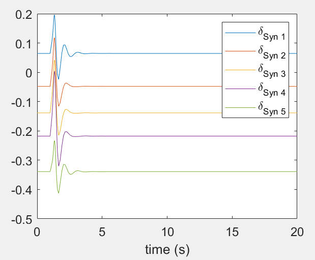  

Rotor Angle Response | Single line diagram 
-------------------------|-------------------------
  |  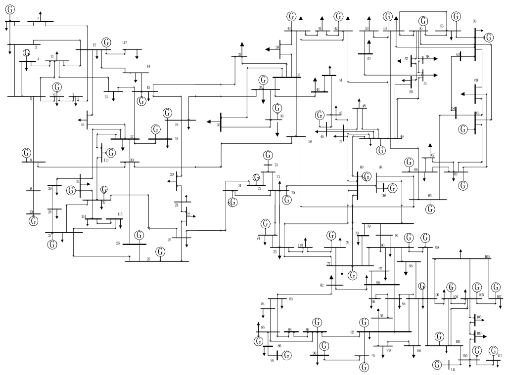

(Note: the PSAT/MATLAB file is converted manually from a MATPOWER format static data file, and from a DIgSILENT format dynamic data file at [118_bus_dig](https://docs.google.com/forms/d/1QzMhNS7FdA4s6rRPN_aVhQQJF_ChZGyCGopA6_6Sx3I/prefill))  
[Request form](https://docs.google.com/forms/d/e/1FAIpQLSfGIjN8_f9o-tTB4_0-i9E7bLH_Fw271mAwq8LY3mUS9FjfLg/viewform)

### IEEE 162-bus, 17 generators (PSAT/MATLAB format)
(unit: *rad*; ref. machine: the generator at bus-108; disturbance: fault happens at bus-4 from 0.1sec to 0.2sec) 

[comment]: 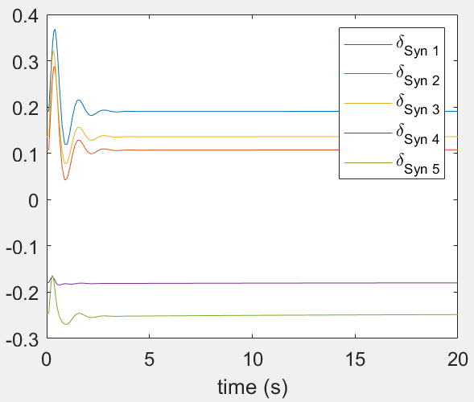  

Rotor Angle Response | Single line diagram 
-------------------------|-------------------------
  |  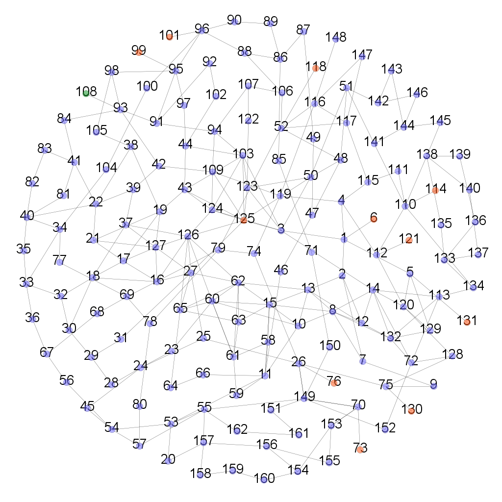

(Note: the PSAT/MATLAB file is converted manually from a IEEE format static data file, and from a BPA format dynamic (generator) data file)  
[Request form](https://docs.google.com/forms/d/e/1FAIpQLSfGIjN8_f9o-tTB4_0-i9E7bLH_Fw271mAwq8LY3mUS9FjfLg/viewform)

### IEEE 145-bus, 50 generators (PSAT/MATLAB format)
(unit: *rad*; ref. machine: the generator at bus-145; disturbance: fault happens at bus-34 from 1sec to 1.1sec) 

[comment]: 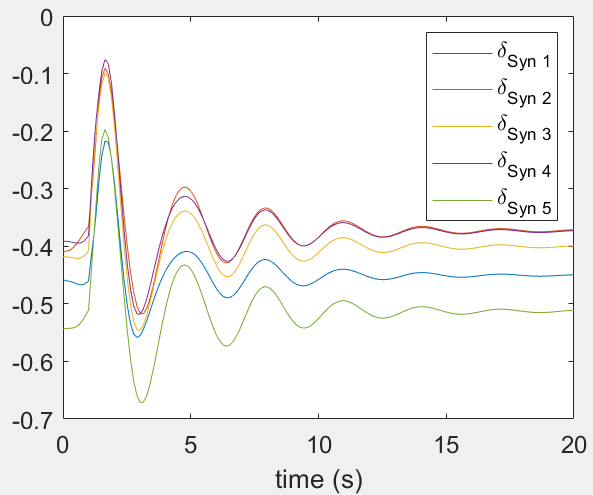  

Rotor Angle Response | Single line diagram 
-------------------------|-------------------------
  |  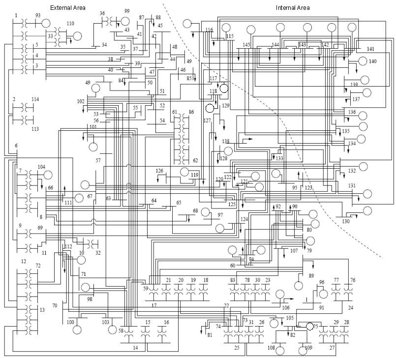

(Note: the PSAT/MATLAB file is converted manually from a IEEE format power flow file, and from a BPA format (dynamic) generator file)  
[Request form](https://docs.google.com/forms/d/e/1FAIpQLSfGIjN8_f9o-tTB4_0-i9E7bLH_Fw271mAwq8LY3mUS9FjfLg/viewform)

### IEEE 140-bus, 48 generators (PSAT/MATLAB format)
(unit: *rad*; ref. machine: the generator at bus-27; disturbance: fault happens at bus-111 from 0.1sec to 0.6sec) 

Rotor Angle Response | Single line diagram 
-------------------------|-------------------------
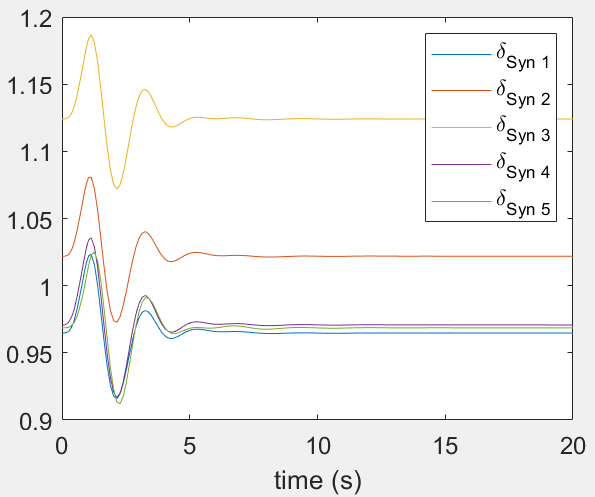  |  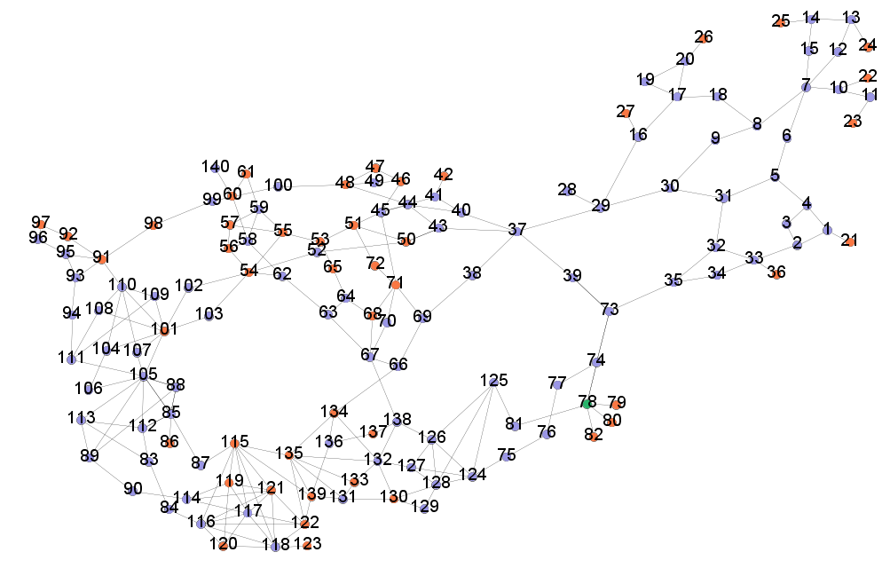

(Note: the PSAT/MATLAB file is converted manually from PST format files)  
[Request form](https://docs.google.com/forms/d/e/1FAIpQLSfGIjN8_f9o-tTB4_0-i9E7bLH_Fw271mAwq8LY3mUS9FjfLg/viewform)

### IEEE 39-bus, 10 generators (PSAT/MATLAB format)
(unit: *rad*; ref. machine: the generator at bus-31; disturbance: fault happens at bus-5 from 1sec to 1.2sec) 

Rotor Angle Response | Single line diagram 
-------------------------|-------------------------
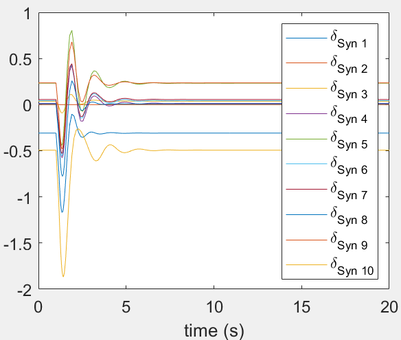  |  

(Note: the PSAT/MATLAB file is converted manually from PST format files)  
[Request form](https://docs.google.com/forms/d/e/1FAIpQLSfGIjN8_f9o-tTB4_0-i9E7bLH_Fw271mAwq8LY3mUS9FjfLg/viewform)

### IEEE 300-bus, 69 generators (PSAT/MATLAB format)
(unit: *rad*; ref. machine: the generator at bus-10055; disturbance: fault happens at bus-1 from 1sec to 1.1sec) 

[comment]: <All 2nd gen model + (PWorld to MATPOWER static + PWorld to PSSE Dyr) + PQ to Z + Back Euler/>

Rotor Angle Response | Single line diagram 
-------------------------|-------------------------
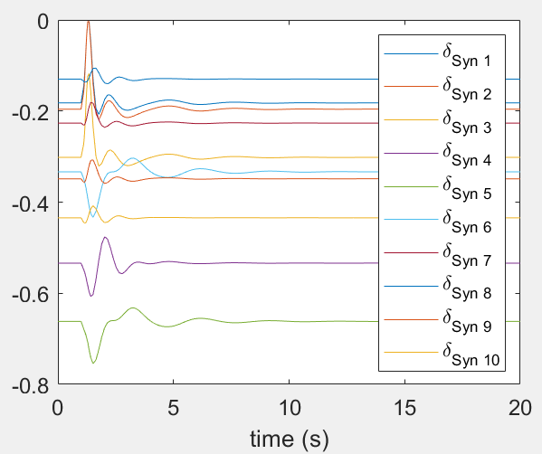  |  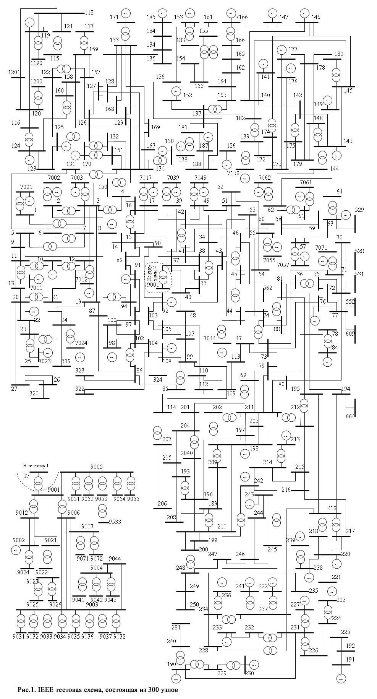

(Note: the PSAT/MATLAB file is converted manually from the PowerWorld format files. The original PowerWorld files are prepared by a team from University of Cyprus [link](https://www2.kios.ucy.ac.cy/testsystems/index.php/ieee-300-bus-modified-test-system/).  
Also, appreciate Prof. Adam Birchfield of the TAMU synthetic power grid team for the help in PowerWorld [link](https://electricgrids.engr.tamu.edu/electric-grid-test-cases/))  
[Request form](https://docs.google.com/forms/d/e/1FAIpQLSfGIjN8_f9o-tTB4_0-i9E7bLH_Fw271mAwq8LY3mUS9FjfLg/viewform)

### UTK 944-bus, 144 generators (PSAT/MATLAB format)
(unit: *rad*; ref. machine: the generator at bus-76; disturbance: fault happens at bus-1 from 2sec to 2.1sec) 

[comment]: <All 2nd gen model + Fixed step + PQ to Z  + Trapz />

Rotor Angle Response | Single line diagram 
-------------------------|-------------------------
  |  

(Note: the PSAT/MATLAB file is converted manually from PSS/E format files)  
[Request form](https://docs.google.com/forms/d/e/1FAIpQLSfGIjN8_f9o-tTB4_0-i9E7bLH_Fw271mAwq8LY3mUS9FjfLg/viewform)

### TAMU Texas 2000-bus, 533 generators (PSAT/MATLAB format)
(unit: *rad*; ref. machine: the generator at bus-7098; disturbance: fault happens at bus-1001 from 3sec to 3.1sec) 

[comment]: <All 2nd gen model + (non MATPOWER ver) Multislack + Fixed step 0.02 + PQ to Z + Back Euler/>

Rotor Angle Response | Single line diagram 
-------------------------|-------------------------
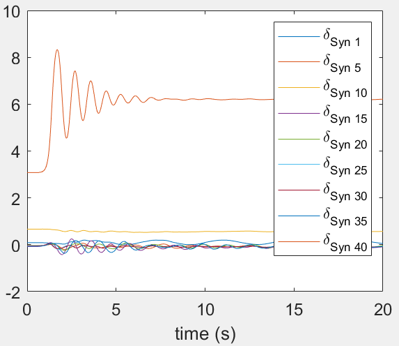  |  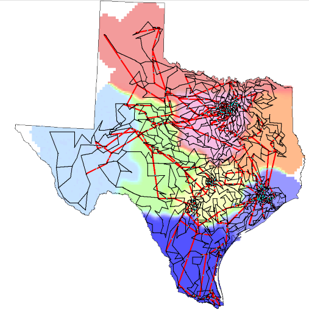

(Note: the PSAT/MATLAB file is converted manually from PSS/E format files. The original PSS/E files are prepared by the TAMU synthetic power grid team led by Prof. Adam Birchfield and Prof. Thomas Overbye [link](https://electricgrids.engr.tamu.edu/electric-grid-test-cases/activsg2000/))  
[Request form](https://docs.google.com/forms/d/e/1FAIpQLSfGIjN8_f9o-tTB4_0-i9E7bLH_Fw271mAwq8LY3mUS9FjfLg/viewform)

## IEEE Distribution Power System Tesbeds
(Coming soon...)

## Disclaimer
- These MATLAB files are manually created based on the above-mentioned third-party source files shared by the academic community. The data in those source files can differ from other publishers’.
- Due to the inherent complicatedness of power system dynamic simulation and the different numerical solver characteristics of open-source/commercial simulators, we do not guarantee the reproducibility of other researchers’ papers using the  data file provided here.
- If these data files are used in your publications, please feel free to cite the web address here, which can give me some encouragement to continue converting more data.
