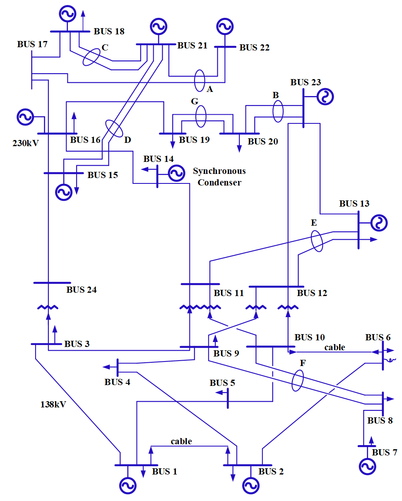

# Power System Reliability Asessment 

  (Note: please fill in your genuine name and institutional email in the following request forms. Fake name or personal email will *NOT* be responded.)

## Results & Benhcmark

### RTS-79 system  
    

MATPOWER format  
[Request form](https://docs.google.com/forms/d/e/1FAIpQLSfGIjN8_f9o-tTB4_0-i9E7bLH_Fw271mAwq8LY3mUS9FjfLg/viewform)

### RTS-96 system
    

MATPOWER format  
[Request form](https://docs.google.com/forms/d/e/1FAIpQLSfGIjN8_f9o-tTB4_0-i9E7bLH_Fw271mAwq8LY3mUS9FjfLg/viewform)

## Distribution Power System for Reliability Assessment
(Coming soon...)

## Disclaimer
- These MATLAB files are manually created based on the above-mentioned third-party source files shared by the academic community. The data in those source files can differ from other publishers’.
- Due to the inherent complicatedness of power system reliability aseessment and the different algorithmic details in different papers, we do not guarantee the reproducibility of other researchers’ papers using the data files provided here.
- If these data files are used in your publications, please feel free to cite the following paper(s), which can give me some encouragement to continue converting more data：

  [1] Yongli Zhu, Chanan Singh. *End-to-End Topology-Aware Machine Learning for Power System Reliability Assessment*. 17th International Conference on Probabilistic Methods Applied to Power Systems (PMAPS 2022), United Kingdom, 12-15 June 2022, Online. 

